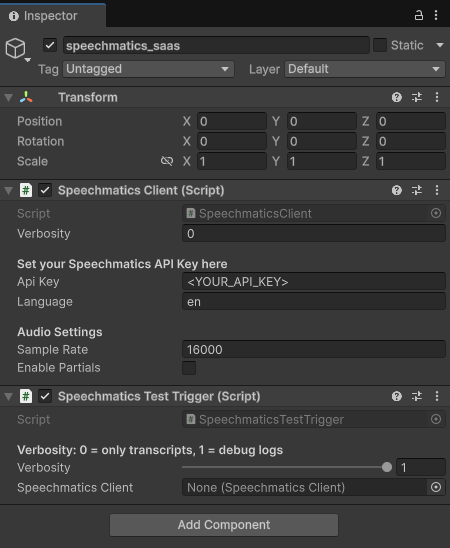

# speechmatics_unity

This repo provides some minimal scripts to integrate Speechmatics RT SaaS into a Unity project.

## Approach

These scripts use the websocket interface to send audio and recieve transcripts. The scripts utilise events to broadcast recieved events, which can be listened for by many components in your project.

## Dependancies

The websocket implementation used is from the NativeWebsocket package: [NWS_github](https://github.com/endel/NativeWebSocket). This can be installed via the unity package manager:

Install via UPM (Unity Package Manager)
1. Open Unity
2. Open Package Manager Window
3. Click Add Package From Git URL
4. Enter URL: https://github.com/endel/NativeWebSocket.git

or by manually cloning the repo:
``` bash
git clone https://github.com/endel/NativeWebSocket
cp -r NativeWebSocket/NativeWebSocket/Assets/WebSocket /path/to/project/Assets
```

## Usage

To use this package, you must have a Speechmatics API key, which can be acquired from: [Speechmatics Portal](https://www.speechmatics.com/)

Apply both the scripts to a game object as shown:



Enter your api key into the editor as shown. When run, the websocket connection will take a few seconds. You can listen to OnConnectionEstablished to see when this is finished. You should get asked for permission to access your microphone. If you set the verbosity to 1, you will be able to see the transcripts in the terminal output.

Speechmatics provides partials (less accurate, subject to change) and final results. These are broadcast to:
- OnTranscriptionReceived
- OnPartialTranscriptionReceived

You can add listeners to your script with:
``` c#
    speechmaticsClient.OnTranscriptionReceived += OnTranscriptionReceived;
    speechmaticsClient.OnPartialTranscriptionReceived += OnPartialTranscriptionReceived;
    speechmaticsClient.OnConnectionEstablished += OnConnectionEstablished;
```
